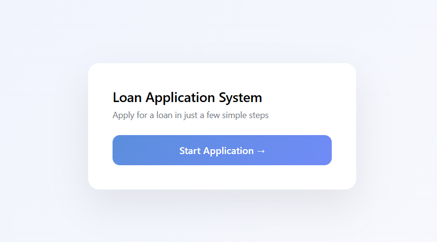
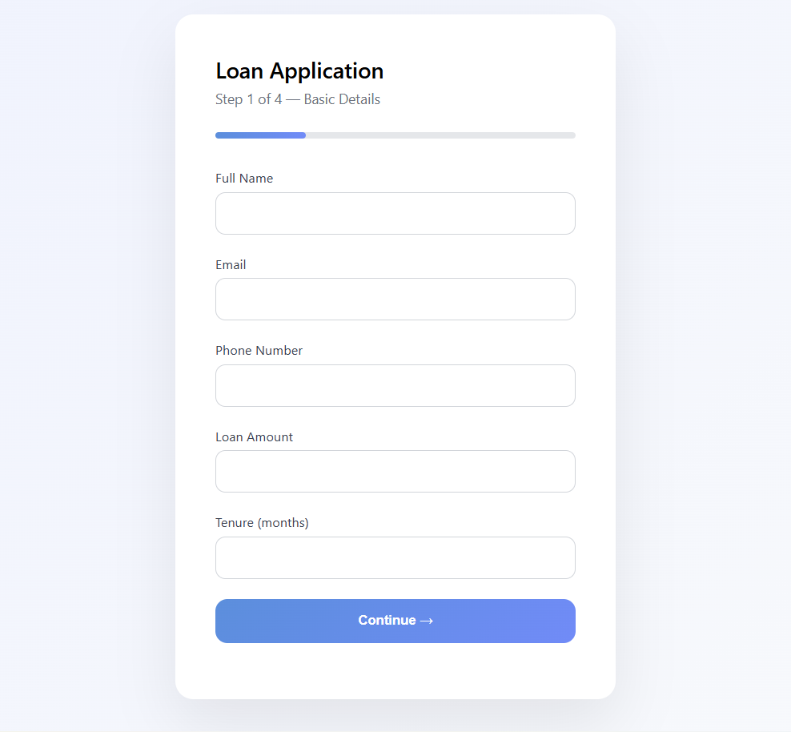
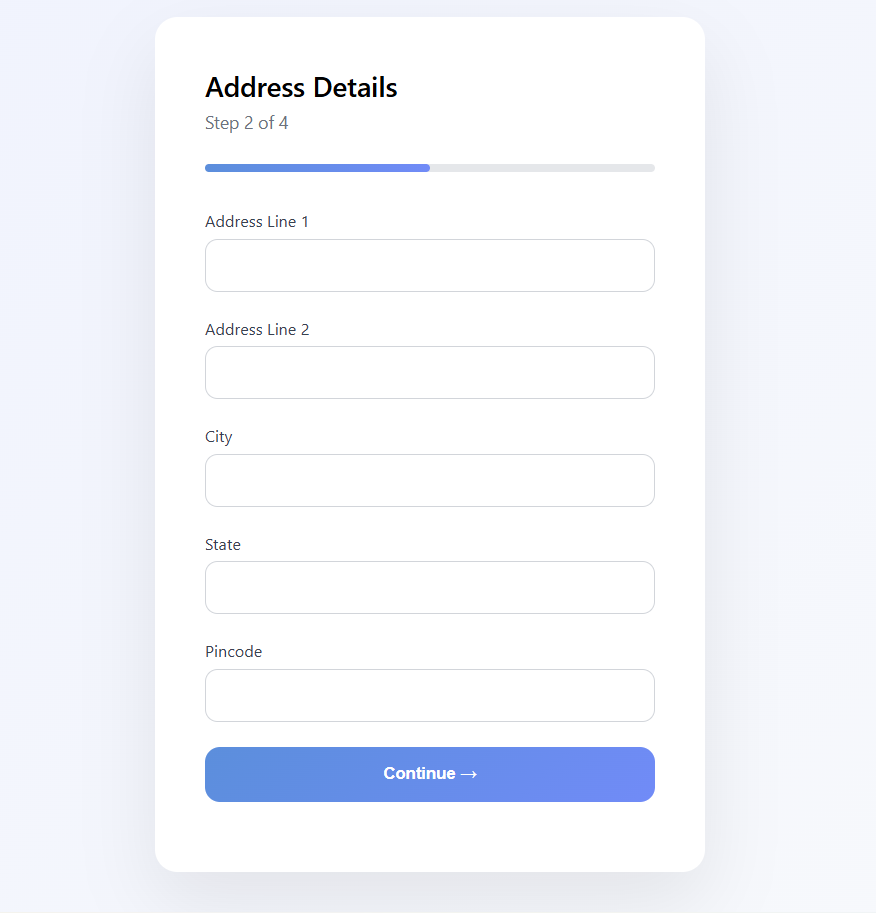
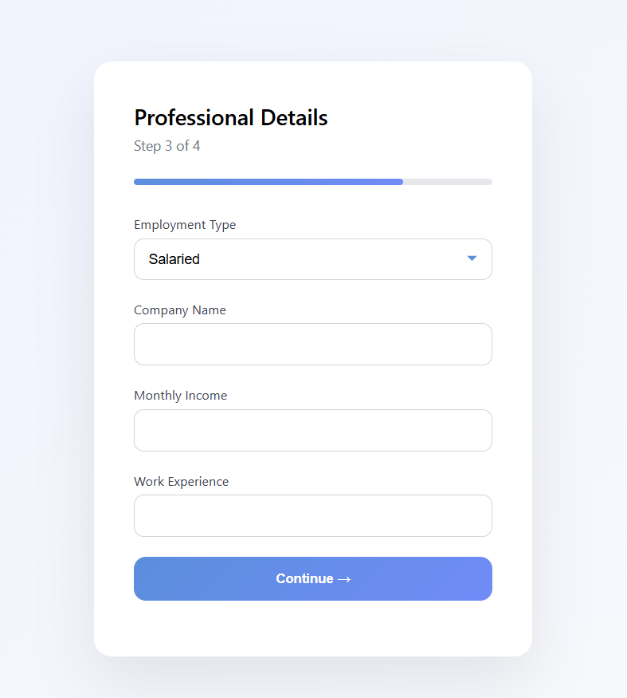
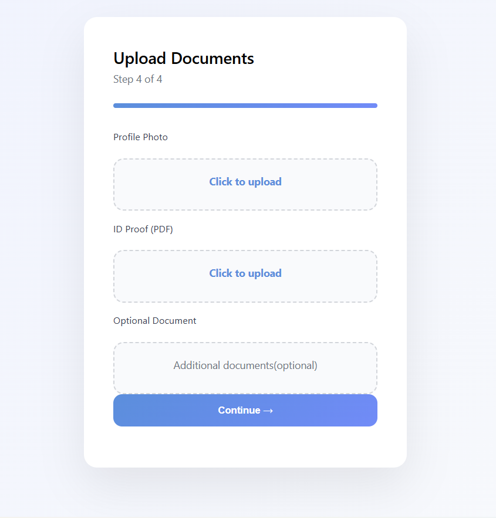
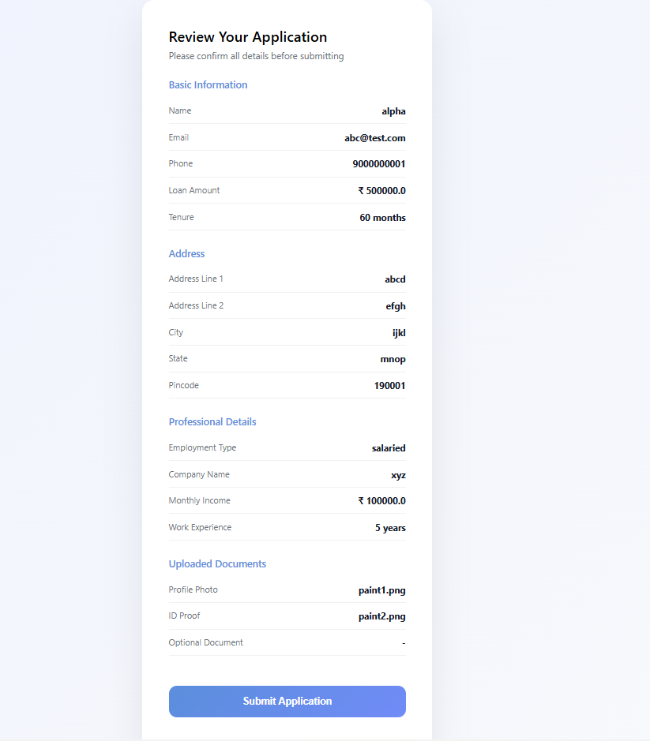
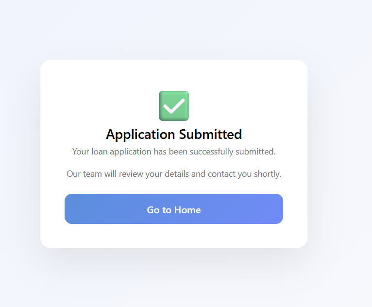

#  Loan Application System

A full-stack Django web application that allows users to apply for loans through a multi-step form with validation, document upload, preview, and final submission.

---

##  Live Demo

 https://your-app.onrender.com

---

##  Features

*  Multi-step loan application form (4 steps)
*  Field validation (frontend + backend)
*  Document upload (image/PDF support)
*  Session-based data persistence
*  Preview before submission
*  Final confirmation page
*  Clean and consistent UI
*  Production-ready deployment on Render

---

##  Screenshots

###  Home Page



---

###  Step 1 – Basic Details



---

###  Step 2 – Address Details



---

###  Step 3 – Professional Details



---

###  Step 4 – Upload Documents



---

###  Preview Page



---

###  Success Page



---

## 🏗️ Project Structure

```
Loan Application system/
│
├── project/
│   ├── core/                 # Django project settings
│   ├── loan_app/             # Main application
│   │   ├── templates/        # HTML templates
│   │   ├── models.py
│   │   ├── forms.py
│   │   ├── views.py
│   │   └── urls.py
│   │
│   ├── static/               # Static files (CSS)
│   │   └── css/
│   │
│   ├── media/                # Uploaded files
│   ├── staticfiles/          # Collected static files (production)
│   ├── manage.py
│   └── requirements.txt
│
├── screenshots/              # README images
│
├── README.md
├── .gitignore
└── .env
```

---

## ⚙️ Tech Stack

* **Backend:** Django (Python)
* **Frontend:** HTML, CSS
* **Database:** PostgreSQL (Supabase)
* **Deployment:** Render
* **Static Files:** WhiteNoise

---

##  Setup Instructions (Local)

### 1️⃣ Clone Repository

```bash
git clone https://github.com/your-username/loan-application-system.git
cd loan-application-system
```

---

### 2️⃣ Create Virtual Environment

```bash
python -m venv venv
venv\Scripts\activate   # Windows
```

---

### 3️⃣ Install Dependencies

```bash
pip install -r project/requirements.txt
```

---

### 4️⃣ Create `.env` File

```env
SECRET_KEY=your_secret_key
DEBUG=True

DB_NAME=your_db
DB_USER=your_user
DB_PASSWORD=your_password
DB_HOST=your_host
DB_PORT=5432
```

---

### 5️⃣ Run Migrations

```bash
python project/manage.py migrate
```

---

### 6️⃣ Run Server

```bash
python project/manage.py runserver
```

---

##  Deployment (Render)

* Set **Root Directory** → `project`
* Build Command:

  ```bash
  pip install -r requirements.txt && python manage.py collectstatic --noinput
  ```
* Start Command:

  ```bash
  gunicorn core.wsgi:application
  ```

### Environment Variables:

```
SECRET_KEY
DEBUG=False
DB_NAME
DB_USER
DB_PASSWORD
DB_HOST
DB_PORT
```

---

##  Key Learnings

* Django multi-step form handling
* Server-side validation
* File uploads in Django
* Session management
* Static files in production
* Deployment on cloud platforms

---

## 👨‍💻 Author

Developed as a full-stack Django project to demonstrate real-world application flow and deployment.

---
